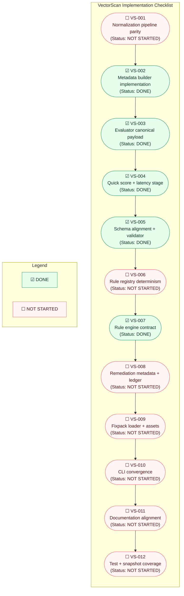

<!-- Generated from checklist/checklist.yml -->

  

**Overall progress:** 42% complete

Notes:

- This file was generated from `checklist/checklist.yml` and annotated using evidence found in `.logs/ai-dev-latest.md`.
- Checkboxes use Unicode: `☑` = done, `☐` = not started. Update statuses by editing the node labels or re-running the generator.
- If you want a different Mermaid layout (Gantt, mindmap, or grouped by Phase), tell me which format and I'll regenerate it.
